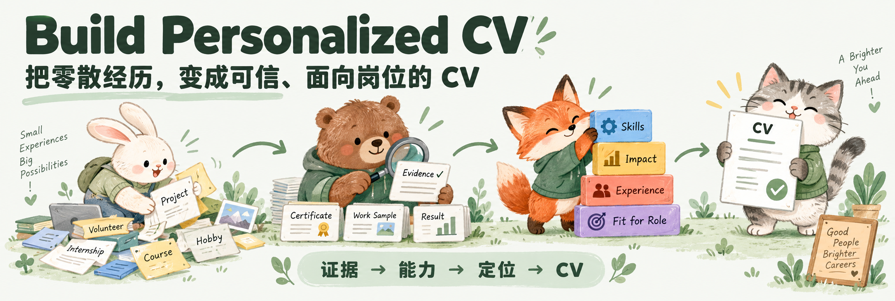
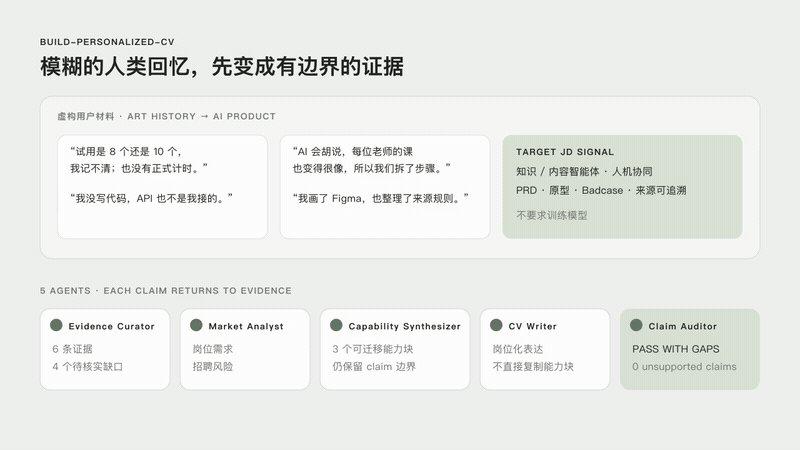
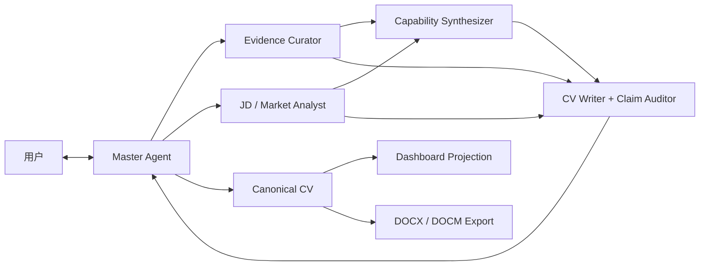

# Build Personalized CV



## 一个CV 共创 Skill。
从原始简历、项目叙述、工作经历和岗位信号中，建立可追溯的证据、可复用的能力资产与受约束的公开表述，再把这些内容编译成面向具体求职方向的中文或英文 CV。

## Demo



## 为什么需要

真正困难的通常不是“把句子写漂亮”，而是同时处理这些问题：

- 经历零散、非线性，无法直接映射到单一职位名称；
- 事实、解释、推测和市场语言混在一起，容易产生过度包装；
- 同一段经历需要为不同岗位方向表达不同价值，但不能改变事实；
- 数字、所有权、影响范围和因果关系经常缺少清晰边界；
- 多轮协作后，AI 容易遗忘已经确认的判断，或反复读取全部历史；
- 能力分析、CV 文案、Dashboard 和 Word 文件容易形成多套相互冲突的版本。

Build Personalized CV 把这些问题视为一个有状态的职业证据工程：事实有来源，判断有边界，角色有写入权限，最终公开文字由用户确认。

## 架构概览

该 Skill 采用五角色 MVP。Master Agent 负责与用户协作并编排任务，四个专业角色各自处理一个清晰的数据域。



### 1. Master Agent

负责用户对话、当前目标、约束、任务路由、取舍与最终接纳。它只把完成当前任务所需的最小上下文交给专业角色，并在用户确认后将文案提升为 canonical output。

### 2. Evidence Curator

是证据库的唯一写入者。它保留用户原话，整理事实、行动、方法、产出、影响、所有权和指标，同时显式记录未知、矛盾与证据边界。它不写 CV 文案，也不替用户选择职业方向。

### 3. JD / Market Analyst

是岗位与市场信号记录的唯一写入者。它保留 JD 原文，提取重复需求、招聘风险和公司阶段问题，并区分稳定市场信号与单次意见。

### 4. Capability Synthesizer

是 Capability Package 的唯一写入者。它把相关证据综合成可复用的能力积木，连接市场需求，并为每项能力记录可安全表达的内容及不可越过的 claim boundary。能力积木不是 CV bullet，也不会被直接复制进简历。

### 5. CV Writer + Claim Auditor

根据有限的 Evidence、Market 与 Capability packets 生成少量实质不同的候选写法，并同时审查所有权、指标、日期、术语、负面信号、篇幅和不受支持的主张。它只产出提案；最终版本仍由用户决定。

## Single-writer 原则

每个数据域只有一个角色可以写入，其他角色只能读取、查询或提出建议。

| 数据域 | 唯一写入者 |
|---|---|
| 经历、证据单元与证据索引 | Evidence Curator |
| JD 来源与市场信号 | JD / Market Analyst |
| 能力积木与证据映射 | Capability Synthesizer |
| 活跃决策、接纳状态与 canonical CV | Master Agent |
| 草稿候选与 claim audit | CV Writer + Claim Auditor |
| Dashboard | 机械发布器，仅投影 canonical state |

这个边界避免多个 Agent 同时改写同一事实，也防止 Dashboard、草稿或聊天记忆成为平行真相源。

## 独立启动

该 Skill 不依赖预先存在的 Evidence Map、Capability Package、JD、Dashboard，也不要求先运行 `career-capability-mapper`。它会根据任务范围选择最小启动方式。

### Ephemeral packet

适合改一条 bullet、审查一项 claim 或处理一个小节。只在当前任务中建立最小证据包，不会为了满足架构而创建完整文件体系。

### Persistent session

适合完整 CV、职业重新定位、多版本协作、Dashboard 或未来复用。Skill 会在工作区建立 `.cv-workflow-session/`，把证据、市场、能力、决策和已接纳文本持久化。

### Import

适合用户已经拥有 Evidence Map、Capability Package 或兼容的职业资产。原始资料保持不变，系统先导入事实证据，再映射派生能力；不确定字段会留待复核。

最小输入只需要：

- 至少一份真实经历来源，例如旧 CV、项目描述、工作叙述或作品集片段；
- 当前要处理的范围，例如一条 bullet、一个小节或完整 CV；
- 输出语言，或足以推断语言的上下文。

目标岗位会显著提升定位质量，但可以暂时保持为 provisional。信息不足时，Skill 只在缺口会实质改变公开表述时追问。

## 工作方式

```text
进入任务
  -> 选择 ephemeral / persistent / import
  -> 整理可追溯证据
  -> 读取或分析岗位信号
  -> 综合可迁移能力与边界
  -> 生成并审查候选文案
  -> 用户修改、接受或拒绝
  -> 更新 canonical state
  -> 按需投影 Dashboard 或导出 Word
```

核心规则：

- 用户原话、数字与 JD 文本作为 source evidence 保留；
- 不虚构范围、所有权、规模、方法、结果、因果或业务影响；
- 事实、解释、假设、市场信号和未知信息相互分离；
- 只检索当前任务需要的 evidence IDs、active rules 与相关分片；
- 新事实只更新受影响的 canonical domain，不触发无关内容重写；
- 草稿只有在用户接受或编辑后，才进入 canonical CV；
- 用户对文案的修改被视为高价值校准证据，而不只是风格偏好；
- 中文与英文版本从同一组已确认 claims 独立本地化，不做机械互译。

更完整的阶段和完成条件见 [`references/workflow.md`](references/workflow.md)。

## Dashboard 协作

Dashboard 是一等协作界面，从 canonical files 机械投影：

- 当前工作阶段与目标岗位族；
- 市场与 JD 信号；
- Capability Package 与证据链接；
- 证据缺口和 claim boundaries；
- 当前 CV 文案与接纳状态；
- 当前任务的角色归属和待用户决策事项。

Dashboard 中的修改会被转换为受控事件：事实纠正交给 Evidence Curator，能力边界交给 Capability Synthesizer，CV 文案进入 claim review，目标与取舍返回 Master。任何界面编辑都不会直接覆盖其他 canonical domain。

## 文件化记忆与最小上下文

持续协作时，记忆保存在文件中，而不是依赖某个 Agent 的对话记忆。入口文件是：

```text
.cv-workflow-session/store/manifest.json
```

Skill 会通过 manifest 定位证据、市场、能力与决策分片，并优先使用查询脚本读取最小相关集合：

```bash
scripts/query-evidence.sh
scripts/query-active-rules.sh
```

新建持久 session：

```bash
python scripts/init-session.py --root <workspace>
```

初始化脚本只创建空 schema，不会导入或编造经历；如果发现有效 manifest，会安全退出而不覆盖现有内容。

## 固定格式中文 Word 导出

在中文 CV 文案全部确认后，可以使用确定性导出器生成 `.docx` ：

```bash
python scripts/export_chinese_cv.py \
  --input accepted-cv.json \
  --output candidate.docx
```

导出阶段冻结已接受文案，只处理固定视觉语法与两项轻量路由：

- 教育经历放在工作经历之前或之后；
- 独立项目放在经历之前、之后，或并入时间线。

默认版式为 A4 单栏、紧凑边距、黑色分隔线、无色块与侧边栏，适合中文招聘阅读。导出后仍需渲染每一页，检查截断、孤立标题、断裂的职位/日期行和意外空白页。布局修复不得偷偷重写已接受的 claim。

详见 [`references/export.md`](references/export.md)。

## 安装

### 使用 Codex 安装

调用 `$skill-installer`，并发送：

```text
请从 https://github.com/GreenW0126/build-personalized-cv 安装这个 Skill。
```

### 使用终端安装

```bash
git clone https://github.com/GreenW0126/build-personalized-cv.git \
  ~/.codex/skills/build-personalized-cv
```

更新已安装版本：

```bash
git -C ~/.codex/skills/build-personalized-cv pull --ff-only
```

如果配置了自定义 `CODEX_HOME`，请将安装路径替换为 `$CODEX_HOME/skills/build-personalized-cv`。

## 使用示例

完整重构：

```text
$build-personalized-cv
这是我的旧 CV 和几段补充经历。请先建立证据结构，再为 AI 产品岗位重构一页中文 CV。
```

单条 bullet：

```text
$build-personalized-cv
请基于下面的项目事实改写一条英文 bullet。不要扩大我的 ownership，给我两个取舍不同的版本。
```

已有职业资产：

```text
$build-personalized-cv
我已经有 Evidence Map 和 Capability Package。请导入后，结合这三份 JD 调整产品研究方向的 CV。
```

Claim audit：

```text
$build-personalized-cv
请审查这份 CV 的数字、因果、所有权和 AI 能力表述，把不受证据支持的部分单独列出。
```

## 适用范围

适合：

- 从零散经历或旧 CV 开始深度重构；
- 为非线性经历建立可信职业定位；
- 将真实经验转化为招聘市场可理解的语言；
- 建立可复用的 evidence 与 capability assets；
- 共创中文或英文 CV bullet、summary 和 section；
- 审查 claim、数字、所有权与表述边界；
- 在文字确认后导出固定格式中文 Word CV。

不适合：

- 自动投递职位；
- 批量爬取招聘网站；
- 为每份 JD 做无证据的关键词替换；
- 编写求职招呼语或外联消息；
- 面试准备；
- 承诺 ATS 通过、面试或 offer 结果。

## 仓库结构

```text
.
├── SKILL.md                         # Skill 入口、路由与核心约束
├── agents/                          # 五角色的可重建 prompt contracts
│   ├── master.md
│   ├── evidence-curator.md
│   ├── market-analyst.md
│   ├── capability-synthesizer.md
│   └── writer-auditor.md
├── references/
│   ├── architecture.md              # 五角色、single-writer 与 handoff contracts
│   ├── bootstrap.md                 # 三种冷启动模式
│   ├── workflow.md                  # 阶段、gates 与 stop conditions
│   ├── evidence-store.md            # 证据存储与查询规则
│   ├── decision-model.md            # 决策程序、权限与校准
│   ├── rewrite-rules.md             # CV 写作与 claim calibration
│   ├── dashboard.md                 # Dashboard 投影与编辑边界
│   └── export.md                    # 中文 Word 导出协议
├── scripts/
│   ├── init-session.py              # 安全初始化持久 session
│   ├── query-evidence.sh            # 按 ID 查询最小证据集合
│   ├── query-active-rules.sh        # 查询当前有效决策规则
│   └── export_chinese_cv.py         # 确定性 Word 导出器
├── CONTRIBUTING.md
├── CHANGELOG.md
└── README.md
```

## 隐私与公开反馈

CV 与经历材料通常包含个人身份、联系方式、公司内部数据和未公开项目。提交 Issue、示例或复现材料前，请删除或改写：

- 姓名、邮箱、电话和地址；
- 客户、同事或内部项目名称；
- 未公开业务数据和精确财务指标；
- 可以组合识别个人或公司的时间、地点与角色细节。

仓库中的案例和测试资料应使用合成数据，不应包含真实用户的私有经历。

## 反馈与贡献

如果 Skill 在某个阶段出现行为偏差，请在 Issue 中说明：

1. 当时的任务范围与输入类型；
2. Skill 选择了哪个路径或角色；
3. 实际输出或行为；
4. 你期待的行为；
5. 已完成脱敏的最小复现材料。

提交前请阅读 [`CONTRIBUTING.md`](CONTRIBUTING.md)。
